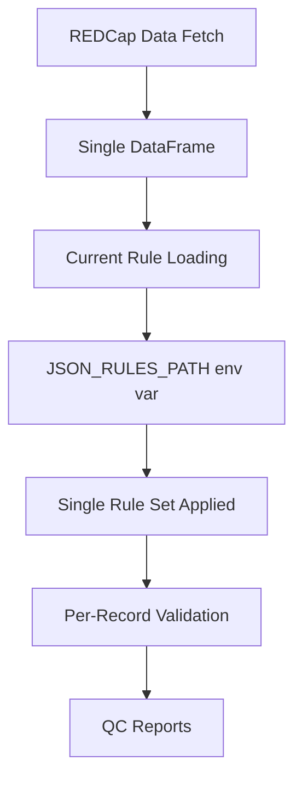
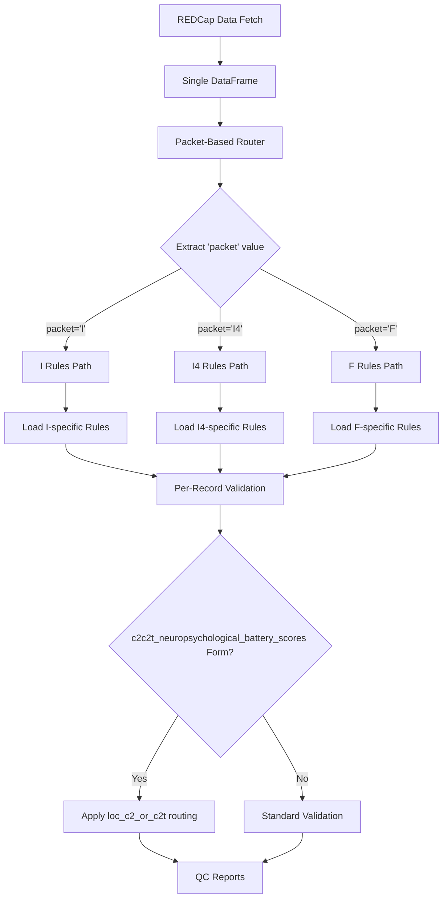

# Data Routing Strategy for Packet-Based QC Validation

## Executive Summary

This document outlines a comprehensive strategy for implementing packet-based routing in the UDSv4 REDCap QC Validator. The current system applies a single set of JSON validation rules to all records. The new requirement involves routing each record to the appropriate rule set based on the **packet** variable (I, I4, F) in the form header, with additional dynamic routing for the C2 form based on the **loc_c2_or_c2t** discriminatory variable.

## Current System Analysis

### Data Flow Architecture



### Current Validation Process

1. **Data Fetching**: REDCap API returns single tabular DataFrame with all instruments
2. **Rule Loading**: Single `JSON_RULES_PATH` environment variable points to one rule directory
3. **Validation**: All records validated against same rule set using `QualityCheck.validate_record()`
4. **Dynamic Instruments**: Currently only C2/C2T uses dynamic routing via `loc_c2_or_c2t`

### Key Components Identified

- **Entry Point**: `src/pipeline/report_pipeline.py` - Main validation orchestration
- **Rule Loading**: `src/pipeline/utils/instrument_mapping.py` - Rule file loading
- **Configuration**: `src/pipeline/config_manager.py` - Environment and path management
- **Validation**: `nacc_form_validator/quality_check.py` - Per-record validation engine
- **Dynamic Processing**: Existing framework for C2/C2T instrument variants

## New Environment Variables Detected

The system already has packet-specific environment variables configured:

```env
JSON_RULES_PATH_I=C:\...\config\I\rules
JSON_RULES_PATH_I4=C:\...\config\I4\rules  
JSON_RULES_PATH_F=C:\...\config\F\rules
```

## Proposed Routing Architecture

### Enhanced Data Flow



## Implementation Strategy

### Phase 1: Core Routing Infrastructure

#### 1.1 Enhanced Configuration Manager

**File**: `src/pipeline/config_manager.py`

```python
# Add packet-specific path configuration
@dataclass
class QCConfig:
    # Existing fields...
    
    # Packet-based rule paths
    json_rules_path_i: str = field(default_factory=lambda: os.getenv('JSON_RULES_PATH_I', ''))
    json_rules_path_i4: str = field(default_factory=lambda: os.getenv('JSON_RULES_PATH_I4', ''))
    json_rules_path_f: str = field(default_factory=lambda: os.getenv('JSON_RULES_PATH_F', ''))
    
    def get_rules_path_for_packet(self, packet: str) -> str:
        """Get the appropriate rules path for a packet type."""
        packet_paths = {
            'I': self.json_rules_path_i,
            'I4': self.json_rules_path_i4,
            'F': self.json_rules_path_f
        }
        return packet_paths.get(packet.upper(), self.json_rules_path)  # Fallback to default
```

#### 1.2 Packet-Based Rule Loader

**File**: `src/pipeline/io/packet_router.py` (New)

```python
from typing import Dict, Any, Optional
from pathlib import Path
import json

class PacketRuleRouter:
    """Routes records to appropriate rule sets based on packet value."""
    
    def __init__(self, config: QCConfig):
        self.config = config
        self._rule_cache = {}
    
    def get_rules_for_record(self, record: Dict[str, Any], instrument_name: str) -> Dict[str, Any]:
        """Get appropriate rules for a record based on its packet value."""
        packet = record.get('packet', '').upper()
        
        if not packet:
            logger.warning(f"No packet value found in record, using default rules")
            packet = 'I'  # Default fallback
        
        cache_key = f"{packet}_{instrument_name}"
        
        if cache_key not in self._rule_cache:
            rules_path = self.config.get_rules_path_for_packet(packet)
            self._rule_cache[cache_key] = self._load_rules(rules_path, instrument_name)
        
        return self._rule_cache[cache_key]
    
    def _load_rules(self, rules_path: str, instrument_name: str) -> Dict[str, Any]:
        """Load rules from specific packet directory."""
        if not rules_path or not Path(rules_path).exists():
            logger.error(f"Rules path not found: {rules_path}")
            return {}
        
        # Use existing instrument mapping logic with packet-specific path
        # This leverages existing dynamic instrument handling
        return load_json_rules_for_instrument_from_path(instrument_name, rules_path)
```

#### 1.3 Enhanced Validation Pipeline

**File**: `src/pipeline/report_pipeline.py` - Modify existing validation logic

```python
# Modify the validate_data function to use packet routing
def validate_data_with_packet_routing(
    data: pd.DataFrame,
    validation_rules: Dict[str, Dict[str, Any]],
    instrument_name: str,
    primary_key_field: str,
) -> Tuple[List[Dict[str, Any]], List[Dict[str, Any]], List[Dict[str, Any]]]:
    """Enhanced validation with packet-based routing."""
    
    config = get_config()
    packet_router = PacketRuleRouter(config)
    
    errors = []
    logs = []
    passed_records = []
    
    for index, record in data.iterrows():
        record_dict = record.to_dict()
        
        # Get packet-specific rules
        packet_rules = packet_router.get_rules_for_record(record_dict, instrument_name)
        
        # Handle C2 dynamic routing (existing logic enhanced)
        if is_dynamic_rule_instrument(instrument_name):
            discriminant_var = get_discriminant_variable(instrument_name)
            discriminant_value = record_dict.get(discriminant_var, '')
            
            if discriminant_value in packet_rules:
                schema = build_cerberus_schema_from_rules(packet_rules[discriminant_value])
            else:
                schema = build_cerberus_schema_from_rules(packet_rules)
        else:
            schema = build_cerberus_schema_from_rules(packet_rules)
        
        # Perform validation using existing QualityCheck engine
        qc = QualityCheck(schema=schema, pk_field=primary_key_field, datastore=None)
        validation_result = qc.validate_record(record_dict)
        
        # Process results (existing logic)
        # ... existing result processing code
```

### Phase 2: Enhanced Dynamic Routing

#### 2.1 Hierarchical Rule Resolution

```python
class HierarchicalRuleResolver:
    """Resolves rules with packet + dynamic instrument routing."""
    
    def resolve_rules(self, record: Dict[str, Any], instrument_name: str) -> Dict[str, Any]:
        """Resolve rules using both packet and dynamic instrument routing."""
        
        # Step 1: Get packet-specific base rules
        packet = record.get('packet', 'I').upper()
        base_rules = self.get_packet_rules(packet, instrument_name)
        
        # Step 2: Apply dynamic routing if applicable
        if is_dynamic_rule_instrument(instrument_name):
            discriminant_var = get_discriminant_variable(instrument_name)
            discriminant_value = record.get(discriminant_var, '')
            
            if discriminant_value in base_rules:
                return base_rules[discriminant_value]
            else:
                logger.warning(f"No rules found for {discriminant_var}={discriminant_value} in packet {packet}")
                
        return base_rules
```

### Phase 3: Backward Compatibility & Migration

#### 3.1 Gradual Migration Strategy

```python
class CompatibilityManager:
    """Manages backward compatibility during migration."""
    
    def __init__(self, config: QCConfig):
        self.config = config
        self.legacy_mode = not all([
            config.json_rules_path_i,
            config.json_rules_path_i4,
            config.json_rules_path_f
        ])
    
    def get_rules_with_fallback(self, record: Dict[str, Any], instrument_name: str) -> Dict[str, Any]:
        """Get rules with fallback to legacy behavior."""
        
        if self.legacy_mode:
            logger.info("Using legacy single-path rule loading")
            return load_json_rules_for_instrument(instrument_name)
        else:
            logger.debug("Using packet-based rule routing")
            return self.packet_router.get_rules_for_record(record, instrument_name)
```

## Implementation Benefits

### 1. **Correctness**

- Records validated against packet-appropriate rules
- Maintains existing C2/C2T dynamic routing
- Proper handling of I, I4, F packet variations

### 2. **Performance**

- Rule caching prevents redundant file loading
- Leverages existing per-record validation engine
- Minimal impact on current pipeline performance

### 3. **Maintainability**

- Clear separation of concerns
- Extends existing dynamic instrument framework
- Backward compatible during transition

### 4. **Scalability**

- Easy to add new packet types
- Framework supports additional discriminatory variables
- Pluggable routing strategy

## Risk Assessment & Mitigation

### High Risk

- **Rule File Missing**: Implement fallback to default rules with logging
- **Invalid Packet Value**: Default to 'I' packet with warning

### Medium Risk

- **Performance Impact**: Mitigated by rule caching and optimized loading
- **Memory Usage**: Rule cache management with LRU eviction

### Low Risk

- **Backward Compatibility**: Gradual migration with feature flags
- **Testing Complexity**: Leverage existing test framework

## Testing Strategy

### 1. Unit Tests

- Packet routing logic validation
- Rule loading for each packet type
- Cache behavior verification
- Fallback mechanism testing

### 2. Integration Tests

- End-to-end validation with packet-specific data
- Mixed packet datasets
- C2 form dynamic routing within packets
- Performance regression testing

### 3. Data Validation Tests

- Validate I, I4, F rule differences
- Ensure packet-specific validation accuracy
- Test edge cases (missing packet, invalid values)

## Migration Timeline

### Task 1: Infrastructure

- Implement `PacketRuleRouter` class
- Update `QCConfig` for packet paths
- Create unit tests for routing logic

### Task 2: Integration

- Modify validation pipeline to use packet routing
- Implement hierarchical rule resolution
- Add C2 form compatibility

### Task 3: Testing & Optimization

- Comprehensive testing with real data
- Performance optimization and caching
- Backward compatibility validation

### Task 4: Deployment & Monitoring

- Gradual rollout with feature flags
- Monitor performance and accuracy
- Documentation and training materials

## Conclusion

The proposed packet-based routing system provides a robust, scalable solution that:

1. **Maintains existing architecture** while adding sophisticated routing
2. **Preserves current C2/C2T dynamic routing** within the packet framework  
3. **Ensures backward compatibility** during migration
4. **Provides clear separation** between packet types while leveraging shared infrastructure
5. **Supports future expansion** with additional packet types or discriminatory variables

The implementation leverages the existing `QualityCheck.validate_record()` engine and dynamic instrument framework, making it a natural evolution of the current system rather than a disruptive overhaul.

---
*Document prepared for UDSv4 REDCap QC Validator - Packet-Based Routing Implementation*
*Date: August 28, 2025*
